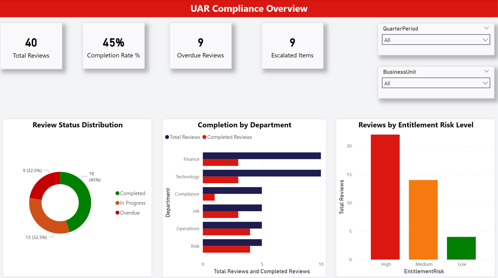
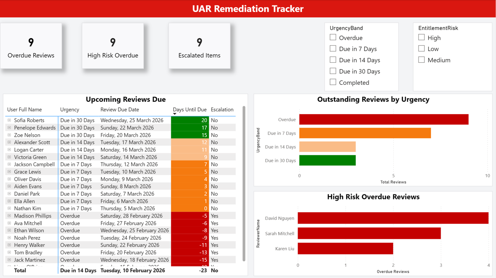
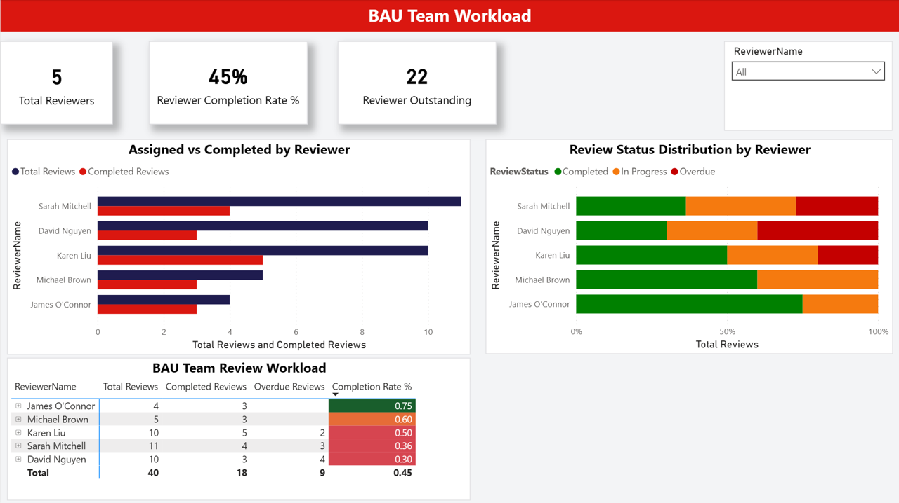
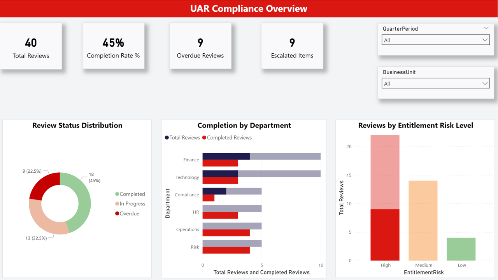
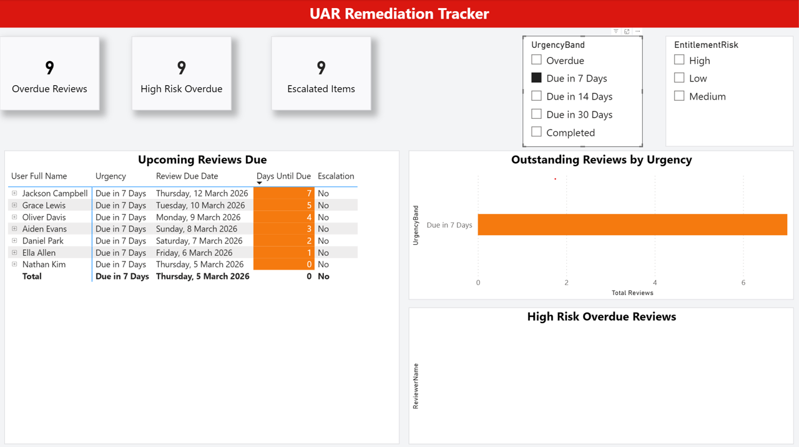
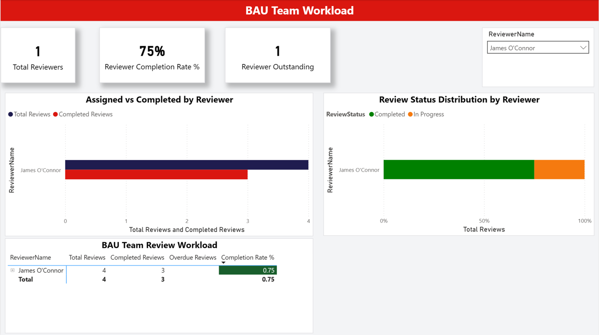

# IAM User Access Review — Power BI Dashboard Suite

A three-dashboard Power BI reporting suite built to support a quarterly 
User Access Review program in a large financial services environment.

## Business Context
The IAM team was tracking UAR completion manually via spreadsheets with 
no visibility into overdue items, reviewer bottlenecks, or urgency prioritisation. 
This suite replaced that process with automated, real-time reporting.

## Dashboards

### 1. UAR Compliance Overview
High-level completion rates, overdue counts, and risk distribution 
for program leadership.

### 2. UAR Remediation Tracker
Operational queue management with urgency banding (7/14/30 days) 
and conditional formatting for the IAM team.

### 3. BAU Team Workload
Reviewer-level completion rates and bottleneck identification 
for the program manager.

## Filtered Views

## Technical Features
- DAX measures with filter context control using CALCULATE and ALL()\
- Conditional formatting on Days Until Due
- Cross-filtering between visuals
- Fixed KPI cards using REMOVEFILTERS to preserve headline metrics
- Organisation aligned system colour palette

## Tools
Power BI Desktop · DAX · CSV data source
